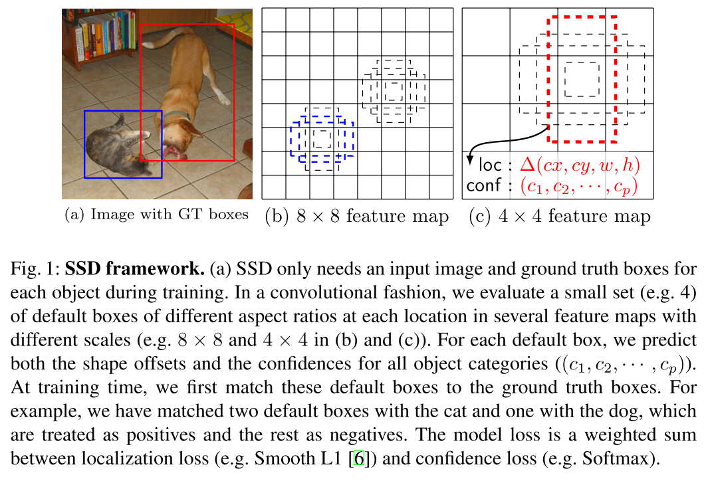

# This project aims to implement SSD algorithm

## Introduction
+ SSD is simple relative to methods that require object proposals because it completely eliminates proposal generation and subsequent pixel or feature resampling stages and escapsulates all computation in a single network
+ SSD discreties the output space of bounding boxes into a set of default boxes over difference aspect ratios and scales per future map location

<div align="center">
  <p>
    <a align="center" href="https://arxiv.org/abs/1512.02325" target="_blank">
      </a>
  </p>
</div>


## Experiment Table

| Backbone | Dataset | Training dataset | Valid dataset | Image size | mAP | mAP_50 | mAP_75 |
|:---:|:---:|:---:|:---:|:---:|:---:|:---:|:---:|
|Original paper|PASCAL VOC|trainval 2007+2012|test2007|300x300|--|--|--|
|ResNet34|PASCAL VOC|trainval 2007+2012|test2007|300x300|--|--|--|
|ResNet50|PASCAL VOC|trainval 2007+2012|test2007|300x300|--|--|--|

## Dataset
+ Download Pascal VOC train+val 2012+2007
+ Download Pascal VOC test 2007

Put all images, annotations, txt files in folder `dataset/VOC` folder as following:

```shell
├── VOC
    ├── images
        ├── trainval2007
            ├── 000005.jpg
            ├── 000007.jpg
        ├── trainval2012
        ├── test2007
    ├── images_id
        ├── trainval2007.txt
        ├── trainval2012.txt
        ├── test2007.txt
    ├── labels
        ├── trainval2007
            ├── 000005.xml
            ├── 000007.xml
        ├── trainval2012
        ├── trainval2007
```

### Training
```shell
python -m src.train --model_type vgg16/vgg16-bn/resnet34/resnet50 --resume resume_most_recent_training
```
### Evaluate
```shell
python -m src.eval --model_type vgg16/vgg16-bn/resnet34/resnet50 --weight_type path_to_weight_best.pt
```

### Prediction
```shell
python -m src.predict --model_type rvgg16/vgg16-bn/resnet34/resnet50 --weight_path path_to_weight_best.pt --input_folder path_input_folder --output_folder path_to_output_folder --conf_thresh confidence_threshold --iou_thresh iou threshold 
```